#  Edge communication using Predictive and Change Point models in Watson IoT and IBM DSX (IoT)  
  
Internet of Things (IoT) have evolved tremendously in all spheres of our lives like Industrial applications, Social interactions, Remote management of facilities and equipment to name a few. In general application areas, IoT data collected by Sensors can be used for monitoring as well as predicting the outcomes. If any deviation from the norm is detected, corrective action can be  prescribed either manually or by an automated process. Such actions may come out of rule based anomaly detection or a Statistical Change point detection or a Predictive model that predicts a faulty condition ahead of time. This approach goes a long way in implementing Predictive maintenance which is more prudent approach than Scheduled Preventive maintenance which is periodic in nature. 

The end to end process steps for applying Analytics on IoT data are listed below:
1.	Collect IoT data from sensor
2.	Change point detection using IoT Sensor data
3.	Predicting equipment failure using IoT Sensor data
4.	Sending decisions based on Analytics insights to the edge for automated action
 
The below two code patterns cover statistical change point detection and predicting equipment failure using IoT sensor data.
* [Detect change points in IoT sensor data - Overview](https://developer.ibm.com/code/patterns/detect-change-points-in-iot-sensor-data/)  
* [Predict equipment failure using IoT sensor data - Overview](https://developer.ibm.com/code/patterns/predict-equipment-failure-using-iot-sensor-data/)

This IBM Code Pattern is a composite pattern that demostrates the building of complete IoT analytics solution.
When you complete this code pattern, you will learn how to:
* Send events from an edge device (we use Raspberry Pi for demonstration) to the Watson IoT Platform
* Store the events in a DB2 database on IBM Cloud
* Invoke a predictive model on Watson Studio for IoT events
* Send a command back to the edge (we use Raspberry Pi for demonstration) based on the outcome of the predictive model

This pattern uses a sample equipment sensors data. This data is sent to the Watson IoT platform and stored in a DB2 database. A predictive model is built using the data in the DB2 database. The predictive model then takes the sensor events from Watson IoT platform as input and returns the state of the equipment as `Running` or `Failing`. If the equipment is failing, then a shutdown command is sent back to the edge device which is a Raspberry Pi.

This pattern uses [Node-RED](https://nodered.org/) at both device and cloud for building the solution:
- Implementing device client on Raspberry Pi to send events to Watson IoT platform
- Consuming events from Watson IoT platform on IBM Cloud and storing the events in a DB2 database
- Invoke predictive model on Watson Studio and get a response back for an IoT event
- Send a command back to the Raspberry Pi through the Watson IoT platform
  
## 1. Prerequisites: 
* [Connect Raspberry Pi to the network and Note IP address for accessing the Pi](https://www.raspberrypi.org/documentation/)
* [Running Node-RED on Raspberry Pi](https://nodered.org/docs/hardware/raspberrypi)  

## 2. Flow
  

1.	The Raspberry Pi gets events from the sensors. In the absence of sensors, the sensor events are read from a file. 
2.	The Node-RED flows are invoked on the Raspberry Pi. 
3.	The sensor events are sent to the Watson IoT platform.  
4.	The Watson IoT platform receives the events and sends it to all subscribing applications. 
5.	The Node-RED flows on IBM Cloud are triggered. The sensor events are recieved and stored into a database. 
6.	The predictive model on Watson Studio is triggered. The outcome of the model execution is sent back to the Node-RED through websockets.
7.	Based on the outcome, the Node-RED flow sends a command with the action to be taken to the edge device(Raspberry Pi) through the Watson IoT platform  
8.	The Node-RED flow on Raspberry Pi recieve the command 
  
## 3. Included Components 
* [IBM Cloud](https://console.bluemix.net/catalog/): IBM's innovative cloud computing platform or IBM Cloud (formerly Bluemix) combines   
  platform as a service (PaaS) with infrastructure as a service (IaaS) and includes a rich catalog of  
  cloud services that can be easily integrated with PaaS and IaaS to build business applications rapidly.  
* [IBM Watson IoT Platform](https://internetofthings.ibmcloud.com/): IBM Watson™ IoT Platform for IBM Cloud gives you a versatile  
  toolkit that includes gateway devices, device management, and powerful application access. By using  
  Watson IoT Platform, you can collect connected device data and perform analytics on real-time data  
  from your organization.  
* [IBM Watson Studio](https://www.ibm.com/bs-en/marketplace/data-science-experience): Analyze data using Python, Jupyter Notebook  
  and RStudio in a configured, collaborative environment that includes IBM value-adds, such as managed Spark.  
* [DB2 Warehouse](https://console.bluemix.net/catalog/services/db2-warehouse): IBM Db2 Warehouse on Cloud is a fully-managed, enterprise-class, cloud data warehouse service.

## 4.	Featured Technologies

* [Analytics](https://developer.ibm.com/code/technologies/analytics?cm=IBMCode-_--_-featured_technologies-_-analytics): Finding patterns in data to derive information.  
* [Data Science](https://developer.ibm.com/code/technologies/data-science?cm=IBMCode-_--_-featured_technologies-_-data-science): Systems and scientific methods to analyze structured and unstructured data in  
  order to extract knowledge and insights.  
* [Internet of Things](https://en.wikipedia.org/wiki/Internet_of_things)

## 5.	Watch the Video  

* [Video](https://youtu.be/2CJcqMPIFaY)  
  
## 6.	Steps  

1.	[Create IBM Cloud services and configure](#6.1-create-ibm-cloud-services-and-configure)
  
### 6.1	Create IBM Cloud services and configure

#### 6.11 Internet of Things Platform
* Click on [Internet of Things Platform](https://console.bluemix.net/catalog/services/internet-of-things-platform) and create an instance of Internet of Things Platform. 
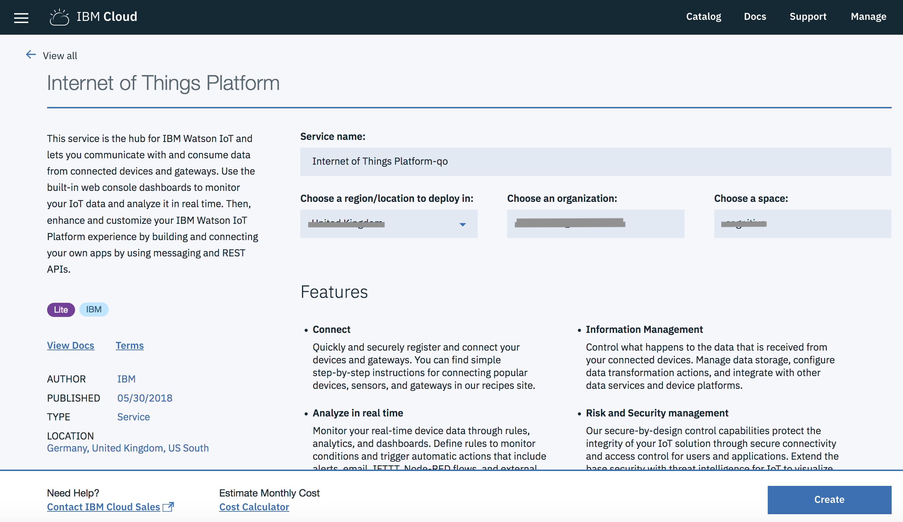  

* Click on `Launch` to launch the `Dashboard`
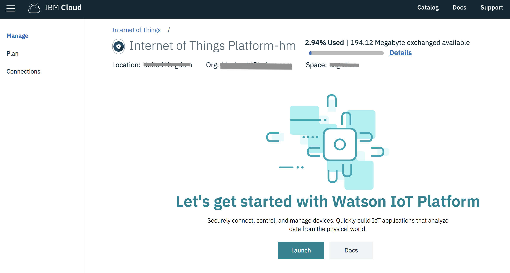  

* Create a device type `Equipment` and device `Sensors`.
Refer [documentation](https://console.bluemix.net/docs/services/IoT/getting-started.html#getting-started-with-iotp) and [article](https://developer.ibm.com/recipes/tutorials/how-to-register-devices-in-ibm-iot-foundation/).
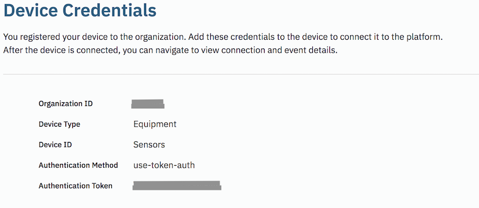  

* Note down the device credentials. They cannot be retrieved later.
> The device credentials will be used later to configure Node-RED.

* Click on `Apps` on the menu.
* Click on `Generate API Key`. Select the role as `Data processor application`. Make a note of the `API Key` and `Authentication Token`. This will be needed in the Node-RED flow configuration in the subsequent steps.

#### 6.12 DB2 Warehouse
* Create a [DB2 Warehouse](https://console.bluemix.net/catalog/services/db2-warehouse) instance.
> Make a note of the service name. This needs to be bound to Node-RED that is created in the next step.
* Click on `Service Credentials`. Click on `New Credential`. Click on `View Credentials`.
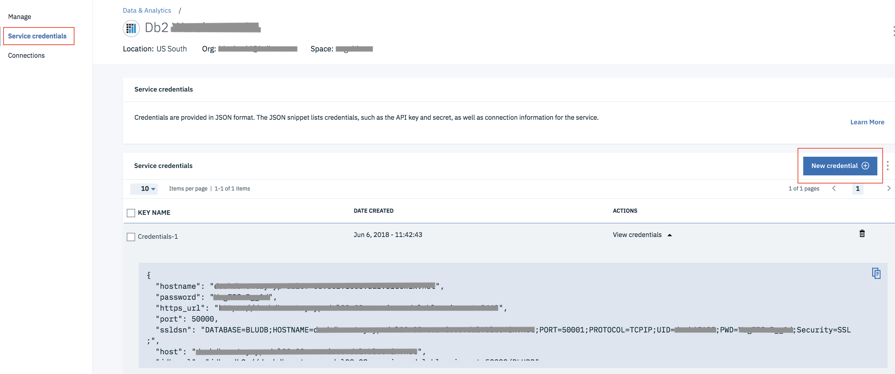  
> Make a note of the database credentials to be entered into Watson Studio notebook later.

* Click on `Manage`
* Click on `Open` to launch the `Dashboard`
* Click on `Explore`.
* Click on the schema starting with `DASH`. 
  
> Make a note of the schema name to be configured later on Watson Studio.

* Click on `New Table` and create a table with the configuration as shown.
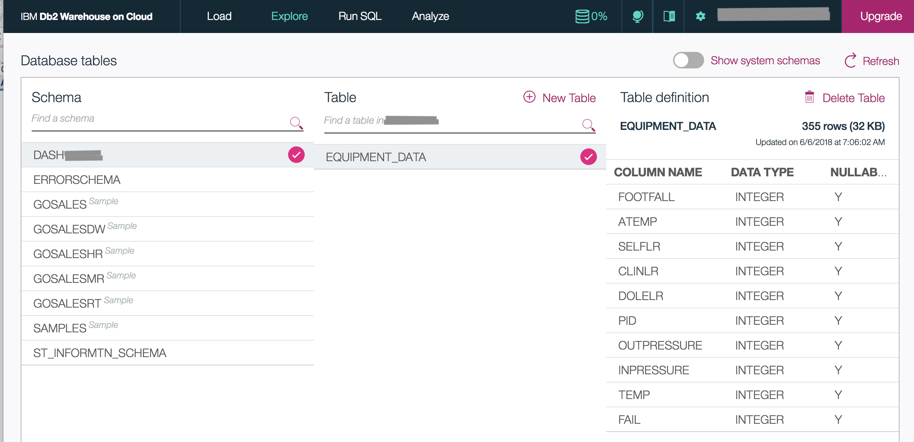  

#### 6.13 Node-RED on IBM Cloud
* Create the [Node-RED Starter application](https://console.bluemix.net/catalog/starters/node-red-starter).
* Choose an appropriate name for the Node-RED application - `App name:`.
* Click on `Create`.

  

* On the newly created Node-RED application page, click on `Connections`.
* Click on `Create Connection` and select the DB2 Warehouse service that was created in the previous step. Click on `Connect`.
> This binds the DB2 Warehouse service to Node-RED.
* Click on `Getting Started`.
* Click on `Visit App URL` to launch the Node-RED editor once the application is in `Running` state.
* On the `Welcome to your new Node-RED instance on IBM Cloud` screen, Click on `Next`.
* On the `Secure your Node-RED editor` screen, enter a username and password to secure the Node-RED editor and click on `Next`.
* On the `Browse available IBM Cloud nodes` screen, click on `Next`.
* On the `Finish the install` screen, click on Finish.
* Click on `Go to your Node-RED flow editor`.  

##### Import the Node-RED flow

* [Clone this repo](https://github.com/IBM/iot-edge-predictive-models-dsx).
* Navigate to the [orchestrate_dsx_workflow.json](https://github.com/IBM/iot-edge-predictive-models-dsx/blob/master/node-red-flow/orchestrate_dsx_workflow.json).
* Open the file with a text editor and copy the contents to Clipboard.
* On the Node-RED flow editor, click the Menu and select `Import` -> `Clipboard` and paste the contents.

 
  
  

* On the two DB2 nodes named `EQUIPMENT_DATA`. Select the DB2 Warehouse service.
  

* Configure the two IoT nodes with the API Key and Authentication Token. Click on `Edit` icon shown in the image and enter the `API Key` and `Authentication Token` noted earlier.
  

##### Deploy the Node-RED flow by clicking on the `Deploy` button

##### Note the websocket URL

The websocket URL is ws://`<NODERED_BASE_URL>`/ws/orchestrate  where the `NODERED_BASE_URL` is the marked portion of the URL in the above image.
### Note:
An example websocket URL for a Node-RED app with name `myApp` is `ws://myApp.mybluemix.net/ws/orchestrate`, where `myApp.mybluemix.net` is the `NODERED_BASE_URL`.

The `NODERED_BASE_URL` may have additional region information i.e. `eu-gb` for the UK region. In this case `NODERED_BASE_URL` would be: `myApp.eu-gb.mybluemix.net`.

#### 6.14 Watson Studio
* Sign up for IBM's [Watson Studio](https://dataplatform.ibm.com/).
* Create a project if necessary, provisioning an object storage service if required.
* In the `Assets` tab, select the `Create notebook` option.
* Select the `From URL` tab.
* Enter a name for the notebook.
* Optionally, enter a description for the notebook.
* Enter this Notebook URL: https://github.com/IBM/iot-edge-predictive-models-dsx/blob/master/notebooks/watson_iotfailure_prediction_integrated.ipynb
* Select the free runtime.
* Click the `Create` button.
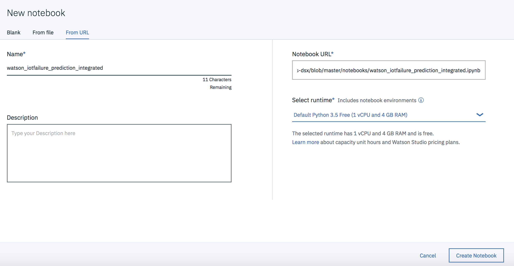  

* In Section 7. of the notebook, enter the websocket URL noted earlier.
  

* In Section 4. of the notebook, enter the database credentials for DB2 Warehouse noted earlier.
  

### 6.2 Configure Node-RED on Raspberry Pi

#### 6.21 Copy the data file to Raspberry Pi and start Node-RED

The data file can be found at the location - https://github.com/IBM/iot-edge-predictive-models-dsx/blob/master/data. Using ftp the file `iot_sensor_dataset.csv` is transferred to the Pi. The file is stored at the location `/home/pi`. After that Node-RED is started by running the command `node-red`.

  

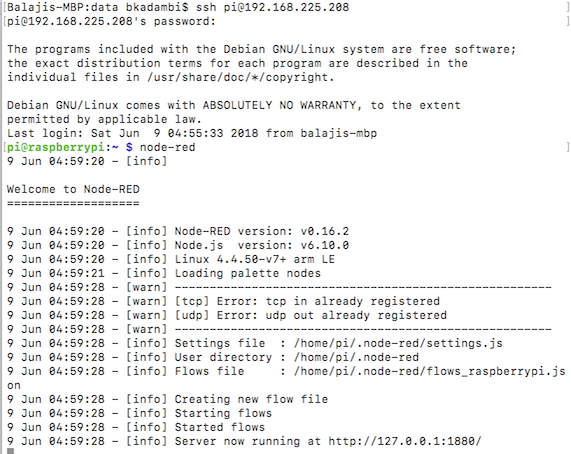  

#### 6.22 Configure Node-RED on the Raspberry Pi

* Navigate to the [orchestrate_dsx_workflow.json](https://github.com/IBM/iot-edge-predictive-models-dsx/blob/master/node-red-flow/pi_flow.json).
* Open the file with a text editor and copy the contents to Clipboard.
* Access Node-RED using the IP address of the RaspberryPi as shown below.
* On the Node-RED flow editor, click the Menu and select `Import` -> `Clipboard` and paste the contents.
* Click on the `event` node.
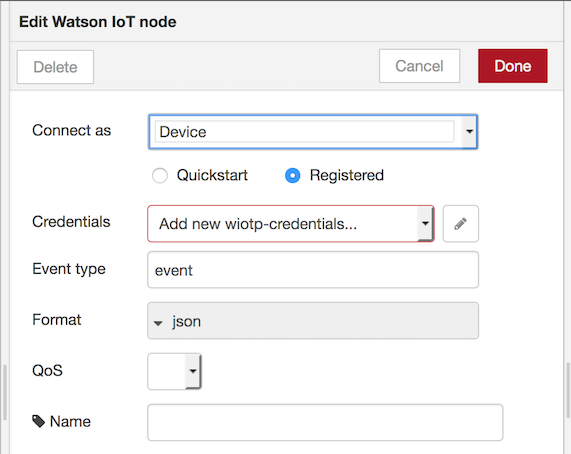  

* Configure the device credentials noted earlier.
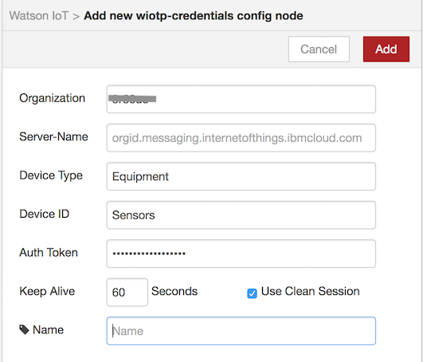  

* Click on the `all commands` node. Select the credentials configured in the previous step.
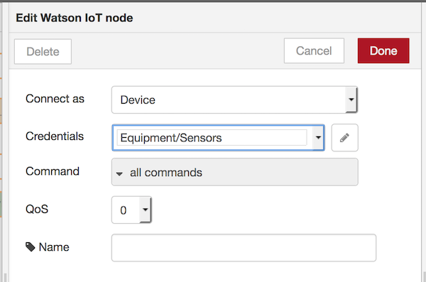  

* Click on `Deploy` to deploy the Node-RED flow.

## 7. Trigger the Node-RED flow on Raspberry Pi
Click on the inject node `Sensor event trigger`. This will send sensor events to the Watson IoT Platform. These events will get stored in the DB2 Warehouse.
  

## 8. Run the notebook

When a notebook is executed, what is actually happening is that each code cell in
the notebook is executed, in order, from top to bottom.

Each code cell is selectable and is preceded by a tag in the left margin. The tag
format is `In [x]:`. Depending on the state of the notebook, the `x` can be:

* A `blank`, this indicates that the cell has never been executed.
* A `number`, this number represents the relative order this code step was executed.
* A `*`, this indicates that the cell is currently executing.

There are several ways to execute the code cells in your notebook:

* One cell at a time.
  * Select the cell, and then press the `Play` button in the toolbar.
* Batch mode, in sequential order.
  * From the `Cell` menu bar, there are several options available. For example, you
    can `Run All` cells in your notebook, or you can `Run All Below`, that will
    start executing from the first cell under the currently selected cell, and then
    continue executing all cells that follow.
* At a scheduled time.
  * Press the `Schedule` button located in the top right section of your notebook
    panel. Here you can schedule your notebook to be executed once at some future
    time, or repeatedly at your specified interval.

For this Notebook, you can simply `Run All` cells.
The websocket client will be started when you run the cell under `7. Start websocket client`. This will start the communication between the UI and the Notebook.

## 9 Analyze results
Go to the Node-RED flow on the Raspberry Pi.
Click on the inject node `Event - Running`. This sends an event with values indicating a good health to the Watson IoT Platform.
Click on the inject node `Event - Failing`. This sends an event with values indicating a failing health to the Watson IoT Platform. A shutdown command is received from the Watson IoT platform after running of the predictive model.
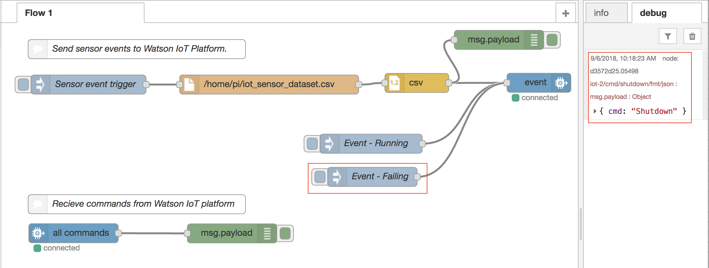  

## 10.	Troubleshooting  
See [Debugging.md](https://github.com/IBM/iot-edge-predictive-models-dsx/blob/master/DEBUGGING.md)  
  
## 11.	License  
See [Apache 2.0](https://github.com/IBM/iot-edge-predictive-models-dsx/blob/master/LICENSE)  
   
